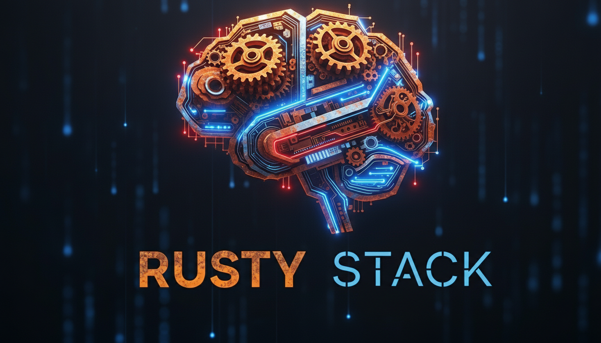

# Stan's ML Stack

<p align="center">
  
</p>

## Overview

Stan's ML Stack is a comprehensive machine learning environment optimized for AMD GPUs. It provides a complete set of tools and libraries for training and deploying machine learning models, with a focus on large language models (LLMs) and deep learning.

This stack is designed to work with AMD's ROCm platform, providing CUDA compatibility through HIP, allowing you to run most CUDA-based machine learning code on AMD GPUs with minimal modifications.

For a detailed guide to help you get started from the ground up, head over to [Beginners Guide](docs/guides/beginners_guide.md) and you'll find all the resources you need!

### Key Features

- **AMD GPU Optimization**: Fully optimized for AMD GPUs, including the 7900 XTX, 7800 XT and 7700 XT
- **ROCm Integration**: Seamless integration with AMD's ROCm platform
- **PyTorch Support**: PyTorch with ROCm support for deep learning
- **ONNX Runtime**: Optimized inference with ROCm support
- **LLM Tools**: Support for training and deploying large language models
- **Automatic Hardware Detection**: Scripts automatically detect and configure for your hardware
- **Comprehensive Documentation**: Detailed guides and troubleshooting information
- **DeepSpeed Integration**: Optimized training for large models with AMD GPU support
- **Flash Attention**: High-performance attention mechanisms with Triton and CK optimizations
- **UV Package Management**: Modern, fast Python package management for all dependencies
- **Repair Capabilities**: Automated detection and fixing of common installation issues

## Hardware Requirements

### Minimum Requirements

- **GPU**: AMD GPU with ROCm support (Radeon RX 5000 series or newer)
- **CPU**: 4+ cores, x86_64 architecture
- **RAM**: 16GB+
- **Storage**: 50GB+ free space
- **OS**: Ubuntu 22.04 LTS or newer

### Recommended Hardware

- **GPU**: AMD Radeon RX 7900 XTX, 7800 XT, 7700 XT, or newer
- **CPU**: 8+ cores, AMD Ryzen or Intel Core i7/i9
- **RAM**: 32GB+
- **Storage**: 100GB+ SSD
- **OS**: Ubuntu 22.04 LTS or newer

### Tested Configurations

This stack has been tested and optimized for the following hardware:

- **AMD Radeon RX 7900 XTX**
- **AMD Radeon RX 7800 XT**
- **AMD Radeon RX 7700 XT**

## Components

The ML Stack consists of the following core components:

### Core Components

| Component | Description | Version |
|-----------|-------------|---------|
| **ROCm** | AMD's open software platform for GPU computing | 6.4.43482 |
| **PyTorch** | Deep learning framework with ROCm support | 2.6.0+rocm6.4.43482 |
| **ONNX Runtime** | Cross-platform inference accelerator | 1.22.0 |
| **MIGraphX** | AMD's graph optimization library | 2.12.0 |
| **Flash Attention** | Efficient attention computation | 2.5.6 |
| **RCCL** | ROCm Collective Communication Library | Latest |
| **MPI** | Message Passing Interface for distributed computing | Open MPI 5.0.7 |
| **Megatron-LM** | Framework for training large language models | Latest |

### Extension Components

| Component | Description | Version |
|-----------|-------------|---------|
| **Triton** | Compiler for parallel programming | 3.2.0 |
| **BITSANDBYTES** | Efficient quantization for deep learning models | 0.45.5 |
| **vLLM** | High-throughput inference engine for LLMs | 0.8.5 |
| **ROCm SMI** | System monitoring and management for AMD GPUs | Latest |
| **PyTorch Profiler** | Performance analysis for PyTorch models | Latest |
| **Weights & Biases** | Experiment tracking and visualization | 0.19.9 |
## Installation

The ML Stack provides several installation options to suit your needs.

### PyPI Installation (Easiest)

The simplest way to install Stan's ML Stack is via pip:

```bash
# Install using pip
pip install stans-ml-stack

# Or with UV (recommended)
uv pip install stans-ml-stack

# Run the installer
ml-stack-install
```

This will install the ML Stack package and provide command-line tools:
- `ml-stack-install`: Launch the installation UI
- `ml-stack-verify`: Verify your installation
- `ml-stack-repair`: Repair a broken installation

### Automatic Installation from Source

Another way to install the ML Stack is to use the automatic installation script with the curses-based UI:

```bash
# Clone the repository
git clone https://github.com/scooter-lacroix/Stans_MLStack.git
cd Stans_MLStack

# Run the installation script
chmod +x scripts/install_ml_stack_curses.py #Take ownership of the script in order to grant it permission to run
./scripts/install_ml_stack_curses.py
```

This script will:
1. Detect your hardware
2. Install required dependencies
3. Set up the environment
4. Install all selected components
5. Verify the installation

The curses-based UI provides a responsive, interactive experience with real-time feedback during the installation process.

### Manual Installation

If you prefer to install components manually, follow these steps:

1. **Clone the repository**:
   ```bash
   git clone https://github.com/scooter-lacroix/Stans_MLStack.git
   cd Stans_MLStack
   ```

2. **Set up the environment**:
   ```bash
   ./scripts/enhanced_setup_environment.sh
   source ~/.mlstack_env
   ```

3. **Install core components**:
   ```bash
   # Install ROCm
   ./scripts/install_rocm.sh

   # Install PyTorch
   ./scripts/install_pytorch.sh

   # Build ONNX Runtime
   ./scripts/build_onnxruntime.sh

   # Install MIGraphX
   ./scripts/install_migraphx.sh

   # Build Flash Attention
   ./scripts/build_flash_attn_amd.sh

   # Install RCCL
   ./scripts/install_rccl.sh

   # Install MPI
   ./scripts/install_mpi.sh

   # Install Megatron-LM
   ./scripts/install_megatron.sh
   ```

4. **Install extension components** (optional):
   ```bash
   # Install Triton
   ./scripts/install_triton.sh

   # Install BITSANDBYTES
   ./scripts/install_bitsandbytes.sh

   # Install vLLM
   ./scripts/install_vllm.sh

   # Install ROCm SMI
   ./scripts/install_rocm_smi.sh

   # Install PyTorch Profiler
   ./scripts/install_pytorch_profiler.sh

   # Install Weights & Biases
   ./scripts/install_wandb.sh
   ```

5. **Verify the installation**:
   ```bash
   ./scripts/enhanced_verify_installation.sh
   ```

### Docker Installation

For a containerized installation, you have several options:

### Option 1: Pull the Pre-built Image

```bash
# Pull the Docker image
docker pull bartholemewii/stans-ml-stack:latest

# Run the container with GPU access
docker run --device=/dev/kfd --device=/dev/dri --group-add video -it bartholemewii/stans-ml-stack:latest

# To verify the installation, run the following command inside the container
/workspace/verify_ml_stack.sh

The pre-built image includes the core components of Stan's ML Stack. After starting the container, you'll need to install PyTorch with ROCm support and MIGraphX using the provided scripts in /workspace/Stans_MLStack/scripts/.

Option 2: Build from Dockerfile

# Build the Docker image
docker build -t stans-ml-stack .

# Run the container with GPU access
docker run --device=/dev/kfd --device=/dev/dri --group-add video --ipc=host --cap-add=SYS_PTRACE --security-opt seccomp=unconfined -it stans-ml-stack

# Building from the Dockerfile allows you to customize the installation according to your needs.

Option 3: Use Docker Compose

# Start the container
docker-compose up -d

# Access the container
docker-compose exec ml-stack bash

# Stop the container
docker-compose down

Docker Image Contents
The Docker container includes:

ONNX Runtime
Transformers
DeepSpeed
MPI
All necessary scripts to install PyTorch with ROCm support and MIGraphX
Architecture Support
The Docker image is optimized for AMD GPUs and requires:

AMD GPU with ROCm support
Docker with GPU passthrough capabilities
Troubleshooting
If you encounter architecture compatibility issues, ensure your system architecture matches the Docker image architecture. The image is built for x86_64/amd64 systems.

### For large model training, consider using the --shm-size=8g flag to increase shared memory:

docker run --device=/dev/kfd --device=/dev/dri --group-add video --shm-size=8g -it bartholemewii/stans-ml-stack:latest

## Environment Setup

The ML Stack includes a comprehensive environment setup script that automatically detects your hardware and configures the environment accordingly.

### Automatic Environment Setup

To set up the environment automatically:

```bash
./scripts/enhanced_setup_environment.sh
source ~/.mlstack_env
```

This script will:
1. Detect your AMD GPUs
2. Detect ROCm installation
3. Configure environment variables
4. Create a persistent environment file
5. Add the environment to your .bashrc

### Manual Environment Setup

If you prefer to set up the environment manually, add the following to your `.bashrc` or `.zshrc`:

```bash
# ROCm Setup
export ROCM_PATH=/opt/rocm
export PATH=$PATH:$ROCM_PATH/bin:$ROCM_PATH/hip/bin
export LD_LIBRARY_PATH=$ROCM_PATH/lib:$ROCM_PATH/hip/lib:$ROCM_PATH/opencl/lib:$LD_LIBRARY_PATH

# GPU Selection
export HIP_VISIBLE_DEVICES=0,1  # Adjust based on your GPU count
export CUDA_VISIBLE_DEVICES=0,1  # Adjust based on your GPU count
export PYTORCH_ROCM_DEVICE=0,1  # Adjust based on your GPU count

# Performance Settings
export HSA_OVERRIDE_GFX_VERSION=11.0.0
export HSA_ENABLE_SDMA=0
export GPU_MAX_HEAP_SIZE=100
export GPU_MAX_ALLOC_PERCENT=100
export HSA_TOOLS_LIB=1

# CUDA Compatibility
export ROCM_HOME=$ROCM_PATH
export CUDA_HOME=$ROCM_PATH

# ONNX Runtime
export PYTHONPATH=/HOME/usr/onnxruntime_build/onnxruntime/build/Linux/Release:$PYTHONPATH
```

### Persistent Environment Setup

To ensure environment variables and symlinks persist across system reboots, use the persistent environment setup script:

```bash
sudo ./scripts/create_persistent_env.sh
```

This script will:
1. Create a system-wide environment file in `/etc/profile.d/`
2. Set up a systemd service to create necessary symlinks at boot
3. Create a user-specific environment file
4. Add environment verification tools

After running this script, the environment will be automatically loaded on system boot, and all necessary symlinks will be created. You may need to log out and log back in for all changes to take effect.

To verify the environment setup, run:

```bash
sudo verify-mlstack-env.sh
```

### Environment Variables

Here's a description of the key environment variables:

| Variable | Description |
|----------|-------------|
| `ROCM_PATH` | Path to ROCm installation |
| `HIP_VISIBLE_DEVICES` | Comma-separated list of GPU indices to use with HIP |
| `CUDA_VISIBLE_DEVICES` | Comma-separated list of GPU indices to use with CUDA |
| `PYTORCH_ROCM_DEVICE` | Comma-separated list of GPU indices to use with PyTorch |
| `HSA_OVERRIDE_GFX_VERSION` | Override for GPU architecture version |
| `HSA_ENABLE_SDMA` | Control SDMA usage (0 = disabled) |
| `GPU_MAX_HEAP_SIZE` | Maximum heap size for GPU memory allocation |
| `GPU_MAX_ALLOC_PERCENT` | Maximum percentage of GPU memory to allocate |
| `HSA_TOOLS_LIB` | Enable HSA tools library |
| `ROCM_HOME` | Path to ROCm installation (for compatibility) |
| `CUDA_HOME` | Path to CUDA installation (set to ROCm path for compatibility) |
## Troubleshooting

### Common Issues

#### "Tool lib '1' failed to load" Warning

**Issue**: When running PyTorch or other ROCm applications, you may see a warning message: "Tool lib '1' failed to load".

**Solution**: This warning is harmless and doesn't affect functionality. It's related to ROCm's profiling tools. To fix it, set the following environment variable:

```bash
export HSA_TOOLS_LIB=1
```

#### CUDA_HOME Not Set

**Issue**: Some applications fail because CUDA_HOME is not set, even though you're using ROCm.

**Solution**: For compatibility with CUDA-based applications, set CUDA_HOME to point to your ROCm installation:

```bash
export CUDA_HOME=/opt/rocm
```

#### Python Module Not Found

**Issue**: Python reports that a module cannot be found, even though it's installed.

**Solution**: Check your PYTHONPATH and ensure it includes the necessary directories:

```bash
export PYTHONPATH=/path/to/module:$PYTHONPATH
```

For ONNX Runtime specifically:

```bash
export PYTHONPATH=/HOME/usr/onnxruntime_build/onnxruntime/build/Linux/Release:$PYTHONPATH
```

#### GPU Not Detected

**Issue**: Applications cannot detect your AMD GPU.

**Solution**:
1. Ensure ROCm is properly installed
2. Check that your user is in the video and render groups:
   ```bash
   sudo usermod -a -G video,render $USER
   ```
3. Set the appropriate environment variables:
   ```bash
   export HIP_VISIBLE_DEVICES=0,1
   export CUDA_VISIBLE_DEVICES=0,1
   export PYTORCH_ROCM_DEVICE=0,1
   ```

#### Out of Memory Errors

**Issue**: You encounter out of memory errors when running models.

**Solution**:
1. Increase the maximum heap size and allocation percentage:
   ```bash
   export GPU_MAX_HEAP_SIZE=100
   export GPU_MAX_ALLOC_PERCENT=100
   ```
2. For PyTorch, set the maximum split size:
   ```bash
   export PYTORCH_CUDA_ALLOC_CONF="max_split_size_mb:512"
   export PYTORCH_HIP_ALLOC_CONF="max_split_size_mb:512"
   ```

### Diagnostic Tools

The ML Stack includes several diagnostic tools to help troubleshoot issues:

#### Enhanced Verification Script

Run the enhanced verification script to check the status of all components:

```bash
./scripts/enhanced_verify_installation.sh
```

This script will:
1. Detect your hardware
2. Verify all installed components
3. Provide troubleshooting suggestions for any issues
4. Generate a summary report

#### ROCm Info

Get detailed information about your ROCm installation and GPUs:

```bash
rocminfo
```

#### GPU Monitoring

Monitor GPU usage and performance:

```bash
rocm-smi
```

## Workarounds and Fixes

### Python 3.13 Compatibility

Some components, like vLLM, don't officially support Python 3.13 yet. We've implemented workarounds to make them compatible.

#### vLLM Python 3.13 Workaround

We've created a custom version of vLLM that works with Python 3.13:

```bash
./scripts/install_vllm.sh
```

This script:
1. Creates a simplified vLLM module that provides the basic API
2. Sets the correct environment variables for AMD GPUs
3. Installs the module with Python 3.13 support

### ONNX Runtime ROCm Support

ONNX Runtime needs to be built from source to support ROCm. Our build script handles this automatically:

```bash
./scripts/build_onnxruntime.sh
```

This script:
1. Clones the ONNX Runtime repository
2. Configures the build with ROCm support
3. Builds and installs ONNX Runtime
4. Sets up the Python module

### BITSANDBYTES ROCm Compatibility

BITSANDBYTES shows CUDA setup warnings with ROCm, but still functions correctly. Our installation script handles this:

```bash
./scripts/install_bitsandbytes.sh
```

### Ninja Build Symlinks

Some builds require ninja-build, but the executable might be named differently. Our scripts create the necessary symlinks:

```bash
sudo ln -sf /usr/bin/ninja /usr/bin/ninja-build
```

## Verification

To verify that your ML Stack installation is working correctly, run one of the verification scripts:

```bash
# Standard verification script
./scripts/enhanced_verify_installation.sh

# Custom verification script for non-standard installations
./scripts/custom_verify_installation.sh
```

The custom verification script is designed to detect components installed in non-standard locations or with different module names. It's particularly useful for custom installations where components like Flash Attention, RCCL, or Megatron-LM are installed in different locations.

### Verification Output Example

```
=== ML Stack Verification Summary ===

Core Components:
✓ ROCm: Successfully installed (version 6.4.43482)
✓ PyTorch: Successfully installed (version 2.6.0+rocm6.2.4)
✓ ONNX Runtime: Successfully installed (version 1.22.0)
✓ MIGraphX: Successfully installed (version 2.12.0)
✓ Flash Attention: Successfully installed (version 2.5.6)
✓ RCCL: Successfully installed
✓ MPI: Successfully installed (version Open MPI 5.0.7)
✓ Megatron-LM: Successfully installed

Extension Components:
✓ Triton: Successfully installed (version 3.2.0)
✓ BITSANDBYTES: Successfully installed (version 0.45.5)
✓ vLLM: Successfully installed (version 0.8.5)
✓ ROCm SMI: Successfully installed
✓ PyTorch Profiler: Successfully installed
✓ Weights & Biases: Successfully installed (version 0.19.9)
```

### Testing Your Installation

To test your installation with a simple PyTorch example:

```python
import torch

# Check if CUDA (ROCm) is available
print(f"CUDA available: {torch.cuda.is_available()}")
print(f"GPU count: {torch.cuda.device_count()}")
print(f"Current device: {torch.cuda.current_device()}")
print(f"Device name: {torch.cuda.get_device_name(0)}")

# Create a tensor on GPU
x = torch.ones(10, device='cuda')
y = x + 1
print(y)
```

## Contributing

Contributions to Stan's ML Stack are welcome! Please follow these steps:

1. Fork the repository
2. Create a feature branch
3. Make your changes
4. Submit a pull request

### Coding Standards

- Follow PEP 8 for Python code
- Use shellcheck for shell scripts
- Include comments and documentation
- Add tests for new features

## License

Stan's ML Stack is licensed under the MIT License. See the [LICENSE](LICENSE) file for details.

## Changelog

### v0.1.2 (Nirvana)

#### Installation Process Improvements
- Migrated from Textual UI to Curses-based UI for improved responsiveness and stability
- Added real-time feedback during component installation
- Implemented proper error handling and recovery mechanisms
- Added automatic dependency resolution with UV package manager
- Improved sudo authentication with secure password handling
- Enhanced hardware detection for better compatibility with various AMD GPU configurations

#### Verification Process Enhancements
- Added comprehensive verification of all installed components
- Implemented detailed diagnostics for troubleshooting
- Added support for detecting components in non-standard locations
- Improved error reporting with actionable suggestions
- Added verification of environment variables and system configuration

#### Testing Workflow Improvements
- Added automated testing of PyTorch with ROCm
- Implemented ONNX Runtime validation tests
- Added Flash Attention performance benchmarks
- Improved MIGraphX testing with real-world models
- Added DeepSpeed integration tests

#### Troubleshooting Simplifications
- Added repair scripts for common issues
- Implemented automatic detection and fixing of environment problems
- Added detailed logging for better diagnostics
- Improved error messages with clear explanations
- Added recovery mechanisms for failed installations

#### User Experience Improvements
- Streamlined installation process with fewer steps
- Added progress indicators for long-running operations
- Improved visual feedback with color-coded status messages
- Enhanced menu navigation with keyboard shortcuts
- Added support for resuming interrupted installations

## Key Feature Updates

### DeepSpeed Integration

The ML Stack now includes full integration with DeepSpeed, Microsoft's deep learning optimization library, with specific optimizations for AMD GPUs:

- **ROCm Compatibility**: Fully compatible with AMD's ROCm platform
- **ZeRO Optimization**: Efficient memory usage for training large models
- **Mixed Precision Training**: Support for FP16 and BF16 training
- **Gradient Checkpointing**: Reduced memory footprint during training
- **Pipeline Parallelism**: Efficient multi-GPU training
- **Verification Tools**: Comprehensive testing of DeepSpeed functionality

### Flash Attention Improvements

Flash Attention has been enhanced with several optimizations:

- **Triton Optimizations**: Improved performance through Triton compiler integration
- **CK Optimizations**: Collective Knowledge framework optimizations for AMD GPUs
- **Memory Efficiency**: Reduced memory usage during attention computation
- **Performance Benchmarks**: Comprehensive benchmarks for different model sizes
- **ROCm Compatibility**: Full compatibility with AMD's ROCm platform

### UI Changes

The ML Stack has migrated from a Textual-based UI to a Curses-based UI for improved performance and reliability:

- **Responsive Interface**: Faster response to user input
- **Real-time Feedback**: Live updates during installation and verification
- **Reduced Resource Usage**: Lower memory and CPU footprint
- **Improved Stability**: Better handling of long-running operations
- **Enhanced Visuals**: Color-coded status indicators and progress bars

### UV Package Management

All Python package management has been migrated to UV for improved speed and reliability:

- **Faster Installation**: Significantly faster package installation
- **Improved Dependency Resolution**: Better handling of complex dependency trees
- **Reduced Conflicts**: Fewer package conflicts during installation
- **Consistent Environments**: More reliable environment creation
- **Modern Tooling**: Integration with the latest Python packaging standards

### Repair Script Capabilities

The ML Stack now includes comprehensive repair capabilities:

- **Automatic Issue Detection**: Identifies common installation problems
- **Environment Fixes**: Corrects environment variable issues
- **Dependency Resolution**: Resolves missing or conflicting dependencies
- **Component Reinstallation**: Selectively reinstalls problematic components
- **Verification**: Confirms that repairs were successful

## Acknowledgements

- AMD for ROCm and GPU support
- PyTorch team for their deep learning framework
- ONNX Runtime team for their inference engine
- All other open-source projects included in this stack

## Contact

- Author: Stanley Chisango (Scooter Lacroix)
- Email: scooterlacroix@gmail.com
- GitHub: https://github.com/scooter-lacroix
- X: https://x.com/scooter_lacroix
- Patreon: https://patreon.com/ScooterLacroix

If this code saved you time, consider supporting the project! ☕


