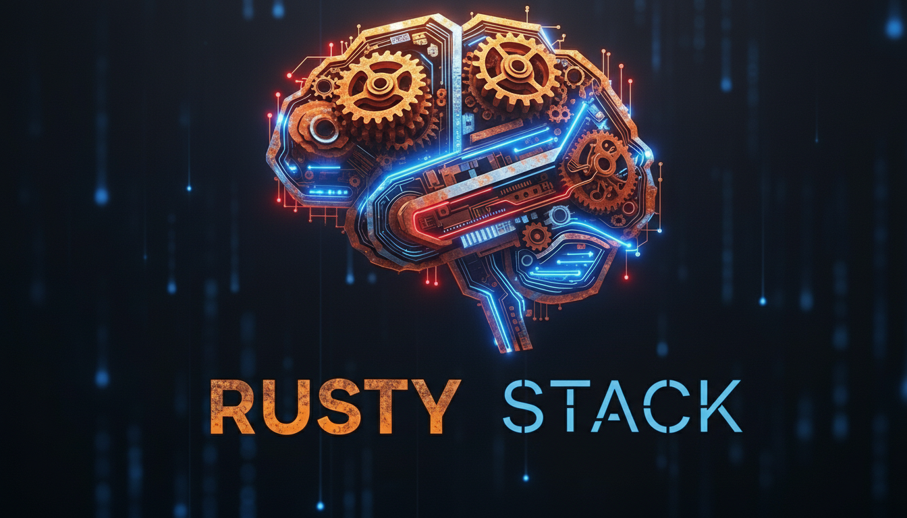

# Rusty Stack

<p align="center">
  
</p>

## Overview

**Rusty Stack** is a comprehensive machine learning environment optimized for AMD GPUs. It provides a complete set of tools and libraries for training and deploying machine learning models, with a focus on large language models (LLMs) and deep learning.

Formerly known as "Stan's ML Stack", this project is undergoing a gradual rebranding to "Rusty Stack" to reflect its modern Rust-based TUI installer. The Python package (`stans-ml-stack`) remains available for backward compatibility.

This stack is designed to work with AMD's ROCm platform, providing CUDA compatibility through HIP, allowing you to run most CUDA-based machine learning code on AMD GPUs with minimal modifications.

For a detailed guide to help you get started from the ground up, head over to [Beginners Guide](docs/guides/beginners_guide.md) and you'll find all the resources you need!

### Key Features

- **AMD GPU Optimization**: Fully optimized for AMD GPUs, including the 7900 XTX, 7800 XT and 7700 XT
- **ROCm Integration**: Seamless integration with AMD's ROCm platform
- **PyTorch Support**: PyTorch with ROCm support for deep learning
- **ONNX Runtime**: Optimized inference with ROCm support
- **ComfyUI**: Node-based AI image generation UI with full ROCm GPU acceleration
- **LLM Tools**: Support for training and deploying large language models
- **Hardware Performance Comparison**: Integrated TUI dashboard to track performance deltas (Before vs. After) across software updates
- **Automatic Hardware Detection**: Scripts automatically detect and configure for your hardware
- **Comprehensive Documentation**: Detailed guides and troubleshooting information
- **DeepSpeed Integration**: Optimized training for large models with AMD GPU support
- **Flash Attention**: High-performance attention mechanisms with Triton and CK optimizations
- **UV Package Management**: Modern, fast Python package management for all dependencies
- **Repair Capabilities**: Automated detection and fixing of common installation issues
- **Manifest Trust Model**: Baseline manifest with remote overlay and fallback chain for secure component resolution
- **Validation Tiers**: Components classified as validated, candidate, experimental, or blocked
- **Risk Classification**: Safe, guarded, and blocked risk levels for dependency-safe execution ordering
- **Failure Isolation**: Individual component failures contained without cascading to other components
- **Shell Parity Migration**: Rust-native installers match legacy shell script behavior for seamless transition
- **Opt-in Anonymous Telemetry**: 180-second stability benchmark with anonymous HTTPS submission
- **Windows Cross-Compilation**: Full Windows support with WSL2 bridging, path translation, and service management

## Hardware Requirements

### Minimum Requirements

- **GPU**: AMD GPU with ROCm support (Radeon RX 5000 series or newer)
- **CPU**: 4+ cores, x86_64 architecture
- **RAM**: 16GB+
- **Storage**: 50GB+ free space
- **OS**: Ubuntu 22.04 LTS or newer

### Recommended Hardware

- **GPU**: AMD Radeon RX 7900 XTX, 7800 XT, 7700 XT, or newer
- **CPU**: 8+ cores, AMD Ryzen or Intel Core i7/i9
- **RAM**: 32GB+
- **Storage**: 100GB+ SSD
- **OS**: Ubuntu 22.04 LTS or newer

### Tested Configurations

This stack has been tested and optimized for the following hardware:

**RDNA 4**

- **AMD Radeon RX 9070 XT**
- **AMD Radeon RX 9070 GRE**
- **AMD Radeon RX 9070**
- **AMD Radeon RX 9060 XT**
- **AMD Radeon RX 9060**

**RDNA 3**
 
- **AMD Radeon RX 7900 XTX**
- **AMD Radeon RX 7900 XT**
- **AMD Radeon RX 7900 GRE**
- **AMD Radeon RX 7800 XT**
- **AMD Radeon RX 7700 XT**  
- **AMD Radeon RX 7700 XT**

**RDNA 2**
  
- **AMD Radeon RX 6950 XT**
- **AMD Radeon RX 6900 XT**
- **AMD Radeon RX 6800 XT**
- **AMD Radeon RX 6800**
- **AMD Radeon RX 6750 XT**
- **AMD Radeon RX 6700 XT**
- **AMD Radeon RX 6700**
- **AMD Radeon RX 6650 XT**

## Sponsor

<p align="center">
  
</p>

Rusty Stack (Stan's ML Stack) is now part of the **Kilo OSS Sponsorship Program**. Your support helps maintain and optimize this stack for the AMD GPU community!

## Components

The ML Stack consists of the following core components:

### Core Components

| Component | Description | Version |
|-----------|-------------|---------|
| **ROCm** | AMD's open software platform for GPU computing | 6.4.43482 |
| **PyTorch** | Deep learning framework with ROCm support | 2.6.0+rocm6.4.43482 |
| **ONNX Runtime** | Cross-platform inference accelerator | 1.22.0 |
| **MIGraphX** | AMD's graph optimization library | 2.12.0 |
| **Flash Attention (Triton)** | High-performance Triton-based kernels | 2.5.6 |
| **Flash Attention CK** | Composable Kernel variant (Pre-release) | Latest |
| **RCCL** | ROCm Collective Communication Library | Latest |
| **MPI** | Message Passing Interface for distributed computing | Open MPI 5.0.7 |
| **Megatron-LM** | Framework for training large language models | Latest |

### Extension Components

| Component | Description | Version |
|-----------|-------------|---------|
| **Triton** | Compiler for parallel programming | 3.2.0 |
| **BITSANDBYTES** | Efficient quantization for deep learning models | 0.45.5 |
| **vLLM** | High-throughput inference engine for LLMs | 0.8.5 |
| **vLLM Studio** | Web UI for vLLM model management and deployment | [Latest](https://github.com/0xSero/vllm-studio) |
| **ROCm SMI** | System monitoring and management for AMD GPUs | Latest |
| **ComfyUI** | Node-based UI for AI image generation with ROCm support | [Latest](https://github.com/comfyanonymous/ComfyUI) |
| **PyTorch Profiler** | Performance analysis for PyTorch models | Latest |
| **Weights & Biases** | Experiment tracking and visualization | 0.19.9 |
## Rusty Stack Platform Architecture

The Rusty Stack engine is organized into five layered modules that handle the full component lifecycle — from detection through planning, execution, verification, and reporting.

```
rusty-stack/src/
├── core/           # Shared types, manifest schema, validation state machine
├── platform/       # Hardware/distro detection, component registry, environment normalization
├── orchestrator/   # Update planner, apply engine, verify runner, upgrade orchestration
├── adapter/        # Adapter registry with Rust and legacy script executors
└── telemetry/      # Stability benchmark, anonymous payload, HTTPS submission, opt-in gate
```

### Module Breakdown

| Module | Files | Description |
|--------|-------|-------------|
| **`core/`** | `types.rs`, `manifest.rs`, `validation.rs`, `plan.rs`, `verification.rs`, `telemetry_types.rs` | Shared types, manifest schema with baseline + remote overlay + fallback chain, validation state machine (validated → candidate → experimental → blocked), plan/verification/telemetry types |
| **`platform/`** | `detection.rs`, `linux.rs`, `windows.rs`, `wsl.rs`, `registry.rs`, `environment.rs`, `path_bridge.rs`, `service.rs`, `control_shell.rs` | Hardware detection, distro detection, component registry, environment normalization, Windows/WSL2 support with path bridging and service management |
| **`orchestrator/`** | `planner.rs`, `apply.rs`, `verify.rs`, `upgrade.rs`, `migration.rs` | Update planner with risk classification (safe/guarded/blocked), apply engine with dependency-safe execution ordering and failure isolation, verify runner, upgrade orchestration, shell parity migration logic |
| **`adapter/`** | `mod.rs`, `rust_adapter.rs`, `legacy_adapter.rs` | Adapter registry with Rust-native and legacy script executors, enabling gradual migration from shell to Rust |
| **`telemetry/`** | `benchmark.rs`, `payload.rs`, `submit.rs`, `opt_in.rs` | 180-second stability benchmark, anonymous payload construction, HTTPS submission client with fire-and-forget, opt-in gate |

### CLI Commands

Rusty Stack exposes a unified `rusty` CLI with subcommands:

```bash
# Interactive TUI installer (default)
rusty

# Component and manifest update (scan → plan → apply → verify)
rusty update [--scan-only] [--all-safe] [--include-experimental] [--json] [COMPONENT...]

# Rusty Stack application/runtime upgrade
rusty upgrade [--yes] [--dry-run]

# Installation verification
rusty verify --full          # Full component verification
rusty verify --enhanced      # Enhanced verification (all components)
rusty verify --build         # Verify and rebuild failed components

# Stability benchmark runner
rusty bench --all            # Run full benchmark suite
rusty bench --rocm           # ROCm benchmarks
rusty bench --json <name>    # JSON output for a specific benchmark
```

### Build & Test

```bash
# Build the unified rusty CLI + TUI installer
cd rusty-stack && cargo build --release

# Run the full test suite
cargo test

# Run without TUI features
cargo check --no-default-features

# Windows cross-compilation
cargo build --target x86_64-pc-windows-msvc
```

## Installation

Rusty Stack installer now offers three ROCm channels so you can balance stability against cutting-edge features:

1. **Legacy (ROCm 6.4.3)** – production-proven for maximum stability
2. **Stable (ROCm 7.1)** – production-ready for RDNA 3 GPUs
3. **Latest (ROCm 7.2.1)** – default choice with expanded RDNA 4 support

You can select the desired channel directly from the interactive installer or pre-seed the choice via the `INSTALL_ROCM_PRESEEDED_CHOICE` environment variable (values: 1-3). See [docs/MULTI_CHANNEL_GUIDE.md](docs/MULTI_CHANNEL_GUIDE.md) for helper scripts covering PyTorch, Triton, Flash Attention, vLLM, ONNX Runtime, MIGraphX, bitsandbytes, and RCCL.

The ML Stack provides several installation options to suit your needs.

### Current Status

- ✅ **Flash Attention (Triton)**: Fully supported and optimized for RDNA 3/4
- 🔄 **Flash Attention CK**: Pre-release testing and debugging in progress

### Quick Install (One-Line)

```bash
curl -fsSL https://raw.githubusercontent.com/scooter-lacroix/Stan-s-ML-Stack/main/scripts/install.sh | bash
```

### Rusty-Stack TUI (Primary Installer)

The recommended way to install Rusty Stack is using the unified `rusty` CLI:

```bash
# Build + run Rusty-Stack
cd rusty-stack
cargo build --release
./target/release/rusty
```

Or use the backward-compatible alias:

```bash
./target/release/rusty-stack
```

This will:
1. Detect your hardware
2. Install required dependencies
3. Set up the environment
4. Install all selected components
5. Verify the installation

The TUI provides a responsive, interactive experience with real-time feedback during the installation process.

### Benchmarking and HTML Report Export

Rusty-Stack includes an integrated benchmarking screen for ROCm, PyTorch, vLLM, DeepSpeed, Megatron-LM, and Flash Attention validation.

After installation:

1. Open the benchmark view (or run the benchmark category tasks).
2. Review in-terminal benchmark summaries and recent errors.
3. Press `E` to export a full HTML benchmark report.

`E` export behavior:

- Generates a detailed visual report with animated charts, labeled axes, data points, and table summaries.
- Shows an explicit success/failure notification in the TUI.
- Prints the output path so you can immediately open/share the report.
- Default output location: `~/.mlstack/reports/benchmark_report_<timestamp>.html`.

This export is designed for performance validation, regression comparison, and shareable install verification evidence.

### PyPI Installation

Install via PyPI (Python package, maintained for backward compatibility):

```bash
pip install stans-ml-stack
```

This will install the core package with all necessary dependencies.

### Legacy Installers (Deprecated)

<details>
<summary>Python Curses Installer (Deprecated)</summary>

The Python curses-based installer is deprecated. Use the unified `rusty` CLI instead:

```bash
cd rusty-stack && cargo build --release
./target/release/rusty
```

The deprecated script is still available at `scripts/install_ml_stack_curses.py` for backward compatibility.

**Note**: This installer is deprecated. Please use the `rusty` CLI instead.

</details>

<details>
<summary>Python Textual Installer (Deprecated)</summary>

The Python Textual-based installer is deprecated. Use the unified `rusty` CLI instead:

```bash
cd rusty-stack && cargo build --release
./target/release/rusty
```

The deprecated script is still available at `scripts/install_ml_stack_ui.py` for backward compatibility.

**Note**: This installer is deprecated. Please use the `rusty` CLI instead.

</details>

<details>
<summary>Go Installer (Deprecated)</summary>

The Go-based installer in `mlstack-installer/` is deprecated and no longer maintained.

</details>

### Manual Installation

If you prefer to install components manually, follow these steps:

1. **Clone the repository**:
   ```bash
   git clone https://github.com/scooter-lacroix/Stan-s-ML-Stack.git
   cd Stan-s-ML-Stack
   ```

2. **Build the rusty CLI**:
   ```bash
   cd rusty-stack
   cargo build --release
   ```

3. **Set up the environment**:
   ```bash
   source ~/.mlstack_env
   ```

4. **Run the TUI installer**:
   ```bash
   ./target/release/rusty
   ```

5. **Verify the installation**:
   ```bash
   ./target/release/rusty verify --full
   ```

3. **Install components via the rusty TUI**:
   ```bash
   ./target/release/rusty
   ```
   The TUI will guide you through selecting and installing core and extension components.

4. **Verify the installation**:
   ```bash
   ./target/release/rusty verify --full
   ```

### Docker Installation

For a containerized installation, you have several options:

### Option 1: Pull the Pre-built Image

```bash
# Pull the Docker image
docker pull bartholemewii/stans-ml-stack:latest

# Run the container with GPU access
docker run --device=/dev/kfd --device=/dev/dri --group-add video -it bartholemewii/stans-ml-stack:latest

# To verify the installation, run the following command inside the container
/workspace/verify_ml_stack.sh

The pre-built image includes the core components of Stan's ML Stack. After starting the container, you'll need to install PyTorch with ROCm support and MIGraphX using the provided scripts in /workspace/Stan-s-ML-Stack/scripts/.

Option 2: Build from Dockerfile

# Build the Docker image
docker build -t stans-ml-stack .

# Run the container with GPU access
docker run --device=/dev/kfd --device=/dev/dri --group-add video --ipc=host --cap-add=SYS_PTRACE --security-opt seccomp=unconfined -it stans-ml-stack

# Building from the Dockerfile allows you to customize the installation according to your needs.

Option 3: Use Docker Compose

# Start the container
docker-compose up -d

# Access the container
docker-compose exec ml-stack bash

# Stop the container
docker-compose down

Docker Image Contents
The Docker container includes:

ONNX Runtime
Transformers
DeepSpeed
MPI
All necessary scripts to install PyTorch with ROCm support and MIGraphX
Architecture Support
The Docker image is optimized for AMD GPUs and requires:

AMD GPU with ROCm support
Docker with GPU passthrough capabilities
Troubleshooting
If you encounter architecture compatibility issues, ensure your system architecture matches the Docker image architecture. The image is built for x86_64/amd64 systems.

### For large model training, consider using the --shm-size=8g flag to increase shared memory:

docker run --device=/dev/kfd --device=/dev/dri --group-add video --shm-size=8g -it bartholemewii/stans-ml-stack:latest

## Environment Setup

The ML Stack includes a comprehensive environment setup script that automatically detects your hardware and configures the environment accordingly.

### Automatic Environment Setup

To set up the environment automatically:

```bash
source ~/.mlstack_env
```

The environment is configured during installation by the rusty CLI bootstrap module. This will:
1. Detect your AMD GPUs
2. Detect ROCm installation
3. Configure environment variables
4. Create a persistent environment file
5. Add the environment to your .bashrc

### Manual Environment Setup

If you prefer to set up the environment manually, add the following to your `.bashrc` or `.zshrc`:

```bash
# ROCm Setup
export ROCM_PATH=/opt/rocm
export PATH=$PATH:$ROCM_PATH/bin:$ROCM_PATH/hip/bin
export LD_LIBRARY_PATH=$ROCM_PATH/lib:$ROCM_PATH/hip/lib:$ROCM_PATH/opencl/lib:$LD_LIBRARY_PATH

# GPU Selection
export HIP_VISIBLE_DEVICES=0,1  # Adjust based on your GPU count
export CUDA_VISIBLE_DEVICES=0,1  # Adjust based on your GPU count
export PYTORCH_ROCM_DEVICE=0,1  # Adjust based on your GPU count

# Performance Settings
export HSA_OVERRIDE_GFX_VERSION=11.0.0
export HSA_ENABLE_SDMA=0
export GPU_MAX_HEAP_SIZE=100
export GPU_MAX_ALLOC_PERCENT=100
export HSA_TOOLS_LIB=1

# CUDA Compatibility
export ROCM_HOME=$ROCM_PATH
export CUDA_HOME=$ROCM_PATH

# ONNX Runtime
export PYTHONPATH=/HOME/usr/onnxruntime_build/onnxruntime/build/Linux/Release:$PYTHONPATH
```

### Persistent Environment Setup

To ensure environment variables and symlinks persist across system reboots, the rusty CLI bootstrap module handles this automatically during installation. The environment file is created at `~/.mlstack_env`.

After installation, the environment will be automatically loaded on system boot, and all necessary symlinks will be created. You may need to log out and log back in for all changes to take effect.

### Environment Variables

Here's a description of the key environment variables:

| Variable | Description |
|----------|-------------|
| `ROCM_PATH` | Path to ROCm installation |
| `HIP_VISIBLE_DEVICES` | Comma-separated list of GPU indices to use with HIP |
| `CUDA_VISIBLE_DEVICES` | Comma-separated list of GPU indices to use with CUDA |
| `PYTORCH_ROCM_DEVICE` | Comma-separated list of GPU indices to use with PyTorch |
| `HSA_OVERRIDE_GFX_VERSION` | Override for GPU architecture version |
| `HSA_ENABLE_SDMA` | Control SDMA usage (0 = disabled) |
| `GPU_MAX_HEAP_SIZE` | Maximum heap size for GPU memory allocation |
| `GPU_MAX_ALLOC_PERCENT` | Maximum percentage of GPU memory to allocate |
| `HSA_TOOLS_LIB` | Enable HSA tools library |
| `ROCM_HOME` | Path to ROCm installation (for compatibility) |
| `CUDA_HOME` | Path to CUDA installation (set to ROCm path for compatibility) |
## Troubleshooting

### Common Issues

#### "Tool lib '1' failed to load" Warning

**Issue**: When running PyTorch or other ROCm applications, you may see a warning message: "Tool lib '1' failed to load".

**Solution**: This warning is harmless and doesn't affect functionality. It's related to ROCm's profiling tools. To fix it, set the following environment variable:

```bash
export HSA_TOOLS_LIB=1
```

#### CUDA_HOME Not Set

**Issue**: Some applications fail because CUDA_HOME is not set, even though you're using ROCm.

**Solution**: For compatibility with CUDA-based applications, set CUDA_HOME to point to your ROCm installation:

```bash
export CUDA_HOME=/opt/rocm
```

#### Python Module Not Found

**Issue**: Python reports that a module cannot be found, even though it's installed.

**Solution**: Check your PYTHONPATH and ensure it includes the necessary directories:

```bash
export PYTHONPATH=/path/to/module:$PYTHONPATH
```

For ONNX Runtime specifically:

```bash
export PYTHONPATH=/HOME/usr/onnxruntime_build/onnxruntime/build/Linux/Release:$PYTHONPATH
```

#### GPU Not Detected

**Issue**: Applications cannot detect your AMD GPU.

**Solution**:
1. Ensure ROCm is properly installed
2. Check that your user is in the video and render groups:
   ```bash
   sudo usermod -a -G video,render $USER
   ```
3. Set the appropriate environment variables:
   ```bash
   export HIP_VISIBLE_DEVICES=0,1
   export CUDA_VISIBLE_DEVICES=0,1
   export PYTORCH_ROCM_DEVICE=0,1
   ```

#### Out of Memory Errors

**Issue**: You encounter out of memory errors when running models.

**Solution**:
1. Increase the maximum heap size and allocation percentage:
   ```bash
   export GPU_MAX_HEAP_SIZE=100
   export GPU_MAX_ALLOC_PERCENT=100
   ```
2. For PyTorch, set the maximum split size:
   ```bash
   export PYTORCH_CUDA_ALLOC_CONF="max_split_size_mb:512"
   export PYTORCH_HIP_ALLOC_CONF="max_split_size_mb:512"
   ```

### Diagnostic Tools

The ML Stack includes several diagnostic tools to help troubleshoot issues:

#### Enhanced Verification Script

Run the enhanced verification via the rusty CLI:

```bash
./target/release/rusty verify --enhanced
```

This will:
1. Detect your hardware
2. Verify all installed components
3. Provide troubleshooting suggestions for any issues
4. Generate a summary report

#### ROCm Info

Get detailed information about your ROCm installation and GPUs:

```bash
rocminfo
```

#### GPU Monitoring

Monitor GPU usage and performance:

```bash
rocm-smi
```

## Workarounds and Fixes

### Python 3.13 Compatibility

Some components, like vLLM, don't officially support Python 3.13 yet. We've implemented workarounds to make them compatible.

#### vLLM Python 3.13 Workaround

We've created a custom version of vLLM that works with Python 3.13. Install via the rusty CLI:

```bash
./target/release/rusty
```

The vLLM installer:
1. Creates a simplified vLLM module that provides the basic API
2. Sets the correct environment variables for AMD GPUs
3. Installs the module with Python 3.13 support

### ONNX Runtime ROCm Support

ONNX Runtime needs to be built from source to support ROCm. The rusty CLI handles this automatically:

```bash
./target/release/rusty
```

The installer:
1. Clones the ONNX Runtime repository
2. Configures the build with ROCm support
3. Builds and installs ONNX Runtime
4. Sets up the Python module

### BITSANDBYTES ROCm Compatibility

BITSANDBYTES shows CUDA setup warnings with ROCm, but still functions correctly. Install via the rusty CLI.

### Ninja Build Symlinks

Some builds require ninja-build, but the executable might be named differently. Our scripts create the necessary symlinks:

```bash
sudo ln -sf /usr/bin/ninja /usr/bin/ninja-build
```

## Verification

To verify that your ML Stack installation is working correctly:

```bash
# Using the unified rusty CLI
cd rusty-stack && cargo build --release
./target/release/rusty verify --full

# Or the enhanced verification
./target/release/rusty verify --enhanced
```

The custom verification script is designed to detect components installed in non-standard locations or with different module names. It's particularly useful for custom installations where components like Flash Attention, RCCL, or Megatron-LM are installed in different locations.

### Verification Output Example

```
=== ML Stack Verification Summary ===

Core Components:
✓ ROCm: Successfully installed (version 6.4.43482)
✓ PyTorch: Successfully installed (version 2.6.0+rocm6.2.4)
✓ ONNX Runtime: Successfully installed (version 1.22.0)
✓ MIGraphX: Successfully installed (version 2.12.0)
✓ Flash Attention: Successfully installed (version 2.5.6)
✓ RCCL: Successfully installed
✓ MPI: Successfully installed (version Open MPI 5.0.7)
✓ Megatron-LM: Successfully installed

Extension Components:
✓ Triton: Successfully installed (version 3.2.0)
✓ BITSANDBYTES: Successfully installed (version 0.45.5)
✓ vLLM: Successfully installed (version 0.8.5)
✓ ROCm SMI: Successfully installed
✓ ComfyUI: Successfully installed (ROCm edition)
✓ PyTorch Profiler: Successfully installed
✓ Weights & Biases: Successfully installed (version 0.19.9)
```

### Testing Your Installation

To test your installation with a simple PyTorch example:

```python
import torch

# Check if CUDA (ROCm) is available
print(f"CUDA available: {torch.cuda.is_available()}")
print(f"GPU count: {torch.cuda.device_count()}")
print(f"Current device: {torch.cuda.current_device()}")
print(f"Device name: {torch.cuda.get_device_name(0)}")

# Create a tensor on GPU
x = torch.ones(10, device='cuda')
y = x + 1
print(y)
```

## Contributing

Contributions to Rusty Stack are welcome! Please follow these steps:

1. Fork the repository
2. Create a feature branch
3. Make your changes
4. Submit a pull request

### Coding Standards

- Follow PEP 8 for Python code
- Use shellcheck for shell scripts
- Include comments and documentation
- Add tests for new features

## License

Rusty Stack (formerly Stan's ML Stack) is licensed under the MIT License. See the [LICENSE](LICENSE) file for details.

## Acknowledgements

- AMD for ROCm and GPU support
- PyTorch team for their deep learning framework
- ONNX Runtime team for their inference engine
- All other open-source projects included in this stack

## Contact

- Author: Stanley Chisango (Scooter Lacroix)
- Email: scooterlacroix@gmail.com
- GitHub: https://github.com/scooter-lacroix
- X: https://x.com/scooter_lacroix
- Patreon: https://patreon.com/ScooterLacroix

If this code saved you time, consider supporting the project! ☕


